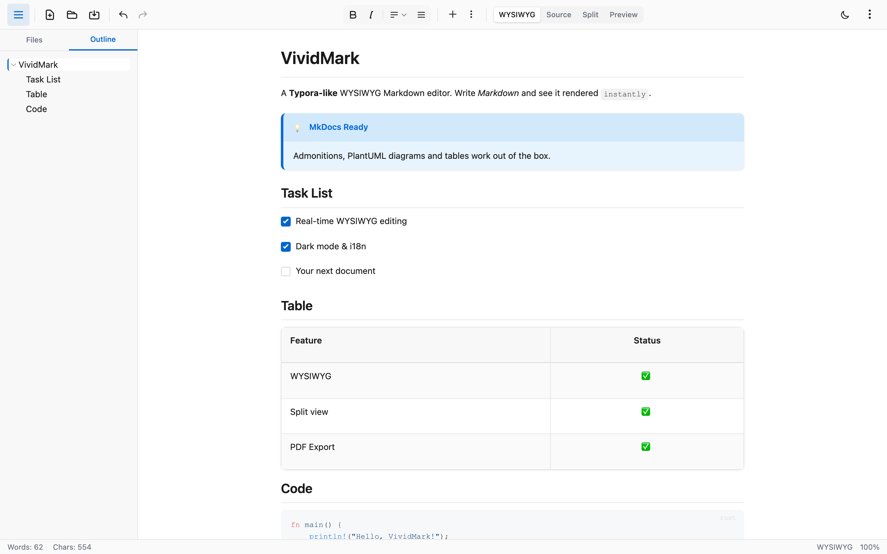
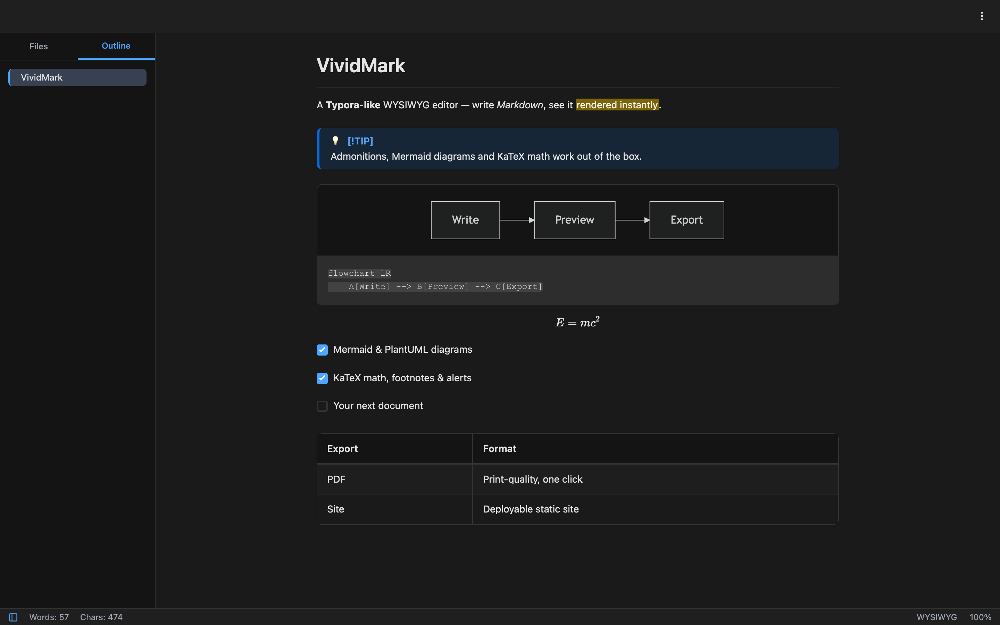
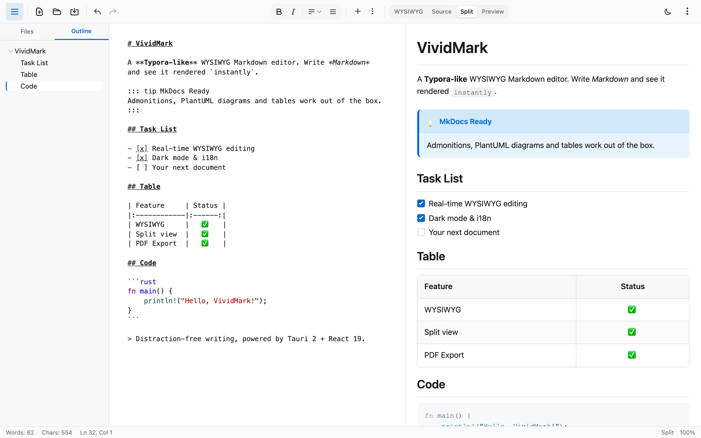

# VividMark

A modern, lightweight Markdown editor built with Tauri 2.0 and React. Inspired by Typora, featuring a clean, distraction-free writing experience with real-time preview.

**Perfect for MkDocs**: Full support for MkDocs-specific syntax including admonitions (callout boxes), PlantUML diagrams, math formulas (KaTeX), and advanced tables — making it an ideal editor for writing and previewing MkDocs documentation.


**English | [简体中文](README.zh-CN.md)**

## 🌐 Website

Visit the project website: **[https://scottli139.github.io/vividmark](https://scottli139.github.io/vividmark)**

## Screenshots

<p align="center">
  
  
</p>
<p align="center">
  
</p>

## Features

### Core Editor

- **Four view modes** - WYSIWYG (seamless live editing, default), Source, Preview (read-only), Split (side-by-side with sync scrolling)
- **CodeMirror 6 editing** - Markdown syntax highlighting, smart list continuation, auto-closing brackets, Tab indentation
- **Real-time Markdown preview** - See your formatted content instantly
- **Find & replace** - Built-in search panel with Cmd/Ctrl + F
- **Status bar** - Word count, cursor position, and zoom level at a glance
- **Code syntax highlighting** - Powered by highlight.js, in both preview and WYSIWYG editing

### File Operations

- **Open/Save/Save As** - Full file management support with native dialogs
- **Keyboard shortcuts** - Cmd/Ctrl + O, S, N for quick access
- **Drag & drop** - Drop Markdown files to open instantly
- **Auto-save** - Automatic saving after 2 seconds of inactivity
- **Recent files** - Quick access to recently opened files
- **Native menus** - Full system menu bar (File/Edit/Paragraph/Format/View) with localized labels, dynamic Open Recent, and OS-level shortcuts
- **macOS Dock menu** - Right-click the Dock icon for New/Open and recent files
- **File associations** - Open .md files via Finder "Open With" or double-click (installed app)
- **Multi-window** - Typora-style SDI: each document opens in its own window; opening an already-open file focuses its window, a clean empty window is reused
- **Context menus** - Right-click in file tree and all editor areas; WYSIWYG menus are context-aware (table row/column editing, link, image, code block)
- **Undo/Redo** - Full history support with Cmd/Ctrl + Z / Shift+Z

### Documentation Site Export

Turn any opened folder into a deployable documentation site with one click — no Python, no mkdocs install, no external tools required:

- **MkDocs-style layout** - Sticky header, collapsible sidebar navigation, and a light/dark toggle baked into every page
- **Auto-derived navigation** - The directory tree becomes the nav; numeric prefixes (`01-intro.md`) control ordering and are stripped from display; `README.md`/`index.md` becomes the section landing page
- **MkDocs-aware** - Folders with a `mkdocs.yml` export by the config: `site_name` as site title, `docs_dir` as content root, `nav` verbatim as the sidebar (external links included) — pages left out of `nav` are still exported, just kept out of the nav. YAML frontmatter is stripped from output and its `title` feeds page titles
- **VuePress-aware (best-effort)** - Folders with a `.vuepress/` directory get the config `title` regex-extracted as site title and `.vuepress/public/*` mirrored to the site root; the sidebar JS config is not parsed — navigation falls back to directory structure
- **Link-safe output** - Cross-page `.md` links are rewritten to `.html` with GitHub-style heading anchors; images and attachments are mirrored in place, so relative paths just work
- **Deploy anywhere** - GitHub Pages (`.nojekyll` included), Netlify, Nginx, or just open `index.html` locally — the output is plain static HTML rendered by the same engine as the in-app preview

### Formatting Tools

- **Inline formatting** - Bold, Italic, Strikethrough, Inline code, Links (Cmd/Ctrl + B / I / K)
- **Block formatting** - Headings (H1-H6), Quote, List, Code block
- **Image insertion** - Menu, paste, or drag & drop with automatic asset management
- **Table editing** - Visual table creation with customizable rows and columns
- **Admonition insertion** - Insert callout boxes (tip, warning, note, etc.) from the Paragraph menu with an optional custom title

### MkDocs-Ready: Extended Markdown Support

- **Tables** - Full GFM table support with alignment

  ```markdown
  | Name  | Age | City |
  | :---- | :-: | ---: |
  | Alice | 25  |  NYC |
  | Bob   | 30  |   LA |
  ```

- **Admonitions** - Beautiful callout boxes for tips, warnings, notes, etc.

  ```markdown
  ::: tip
  This is a helpful tip!
  :::

  ::: warning Important
  This is a warning with custom title.
  :::
  ```

  Supported types: `tip`, `warning`, `info`, `note`, `danger`, `success`, `hint`, `important`, `caution`

  MkDocs-style `!!!` admonitions are also supported on both ends (preview and WYSIWYG) — editing in WYSIWYG keeps the `!!!` fences untouched when saving:

  ```markdown
  !!! note "Custom title"
      Content indented by 4 spaces (no closing fence needed).
  ```

  GitHub-style alerts (`> [!NOTE]` / `[!TIP]` / `[!IMPORTANT]` / `[!WARNING]` / `[!CAUTION]`) render with the same callout styling — in WYSIWYG the marker line stays visible and editable (change `[!NOTE]` to `[!TIP]` to switch themes), with zero source rewriting:

  ```markdown
  > [!WARNING]
  > Urgent info that needs immediate attention.
  ```

- **Footnotes** - GFM-style `[^id]` references with definitions collected at the end of the document and bidirectional back-links; numbering follows first-reference order and stays consistent between WYSIWYG and preview (multiple references to one definition share the same number):

  ```markdown
  Body text with a reference[^1].

  [^1]: The footnote definition, rendered at the end of the document.
  ```

- **Typography Enhancements** - `==highlight==`, `^superscript^`, `~subscript~` and emoji shortcodes (`:smile:`); highlight/superscript/subscript are real inline formats in WYSIWYG (auto-converted as you type the closing delimiter, source preserved on save), while emoji shortcodes stay as literal text in WYSIWYG and render in preview/exports (a single `~` means subscript — strikethrough requires `~~`):

  ```markdown
  ==Highlighted==, E = mc^2^, H~2~O, :rocket:
  ```

- **PlantUML Diagrams** - Render UML diagrams directly in your document with the built-in local engine (@plantuml/core) — fully offline, dark-mode aware, and inlined as SVG in PDF/site exports (falls back to the online service only if local rendering fails)
- **Mermaid Diagrams** - Render flowcharts, sequence diagrams, Gantt charts and more with the bundled mermaid.js — lazily loaded on first diagram, fully offline, dark-mode aware, inlined as SVG in PDF/site exports (syntax errors show an inline error state, no online fallback)
  ```markdown
  @startuml
  Alice -> Bob: Hello
  Bob --> Alice: Hi!
  @enduml
  ```

- **Diagram & Image Viewer** - Click any Mermaid/PlantUML diagram or image in Preview to open a fullscreen viewer — scroll-wheel zoom around the cursor, drag to pan, double-click to reset, Esc to close (in WYSIWYG, diagrams and images show a hover zoom button)

- **Math Formulas** - Render LaTeX math with KaTeX; editable directly in WYSIWYG mode

  ```markdown
  Inline: $e=mc^2$

  $$
  \frac{1}{2}
  $$
  ```

- **YAML Frontmatter** - Document metadata block at the top of a file: stripped from preview/PDF/site output, shown as a read-only card in WYSIWYG (edit it in Source mode), and used for page titles in site export

### User Interface

- **Multi-language support** - English and 简体中文 (Simplified Chinese), easily extensible to more languages
- **Theme modes** - Light, Dark, or Auto (follows system appearance)
- **Settings panel** - Appearance, language, and sidebar preferences in one place
- **Sidebar with outline navigation** - Collapsible outline tree with active-position highlighting and click-to-navigate (works in all view modes)
- **File tree with file management** - Browse folders, filter by name, and open/create/duplicate/rename/delete files, copy paths, or reveal in Finder via the context menu
- **Clean UI** - Minimalist design for focused writing
- **Sync scrolling** - Split mode with bidirectional scroll synchronization

## Tech Stack

- **Frontend**: React 19 + TypeScript + Tailwind CSS 4
- **Backend**: Tauri 2.0 (Rust)
- **Build Tool**: Vite 7
- **State Management**: Zustand 5
- **Internationalization**: i18next + react-i18next
- **Markdown**: markdown-it with custom plugins
- **Extended Syntax**: markdown-it-container, @plantuml/core (offline UML engine), mermaid (offline diagrams), KaTeX
- **Syntax Highlighting**: highlight.js
- **Testing**: Vitest + React Testing Library + Playwright

## AI Development

This project was **entirely built with AI coding assistants**:

| Tool                                                         | Model      |
| ------------------------------------------------------------ | ---------- |
| [Claude Code CLI](https://github.com/anthropics/claude-code) | GLM model  |
| [Kimi CLI](https://www.kimi.com/)                            | Kimi model |

> 🤖 No human-written code. Every line was generated, reviewed, and refined through AI collaboration.

## Getting Started

### Prerequisites

- Node.js 18+
- pnpm (recommended) or npm
- Rust (for Tauri)

### Installation

```bash
# Clone the repository
git clone https://github.com/scottli139/vividmark.git
cd vividmark

# Install dependencies
pnpm install

# Start development server
pnpm tauri dev
```

### Build

```bash
# Build for production
pnpm tauri build
```

## Keyboard Shortcuts

| Shortcut               | Action                  |
| ---------------------- | ----------------------- |
| `Cmd/Ctrl + O`         | Open file               |
| `Cmd/Ctrl + S`         | Save file               |
| `Cmd/Ctrl + Shift + S` | Save as                 |
| `Cmd/Ctrl + N`         | New file                |
| `Cmd/Ctrl + B`         | Bold                    |
| `Cmd/Ctrl + I`         | Italic                  |
| `Cmd/Ctrl + K`         | Insert link             |
| `Cmd/Ctrl + 1 / 2 / 3` | Heading 1 / 2 / 3       |
| `Cmd/Ctrl + F`         | Find & replace          |
| `Cmd/Ctrl + Z`         | Undo                    |
| `Cmd/Ctrl + Shift + Z` | Redo                    |
| `Cmd/Ctrl + /`         | Toggle WYSIWYG / Source |
| `Cmd/Ctrl + = / - / 0` | Zoom in / out / reset   |
| `Escape`               | Exit edit mode          |

## Project Structure

```
vividmark/
├── src/                    # React frontend
│   ├── components/
│   │   ├── Editor/         # Core editor component
│   │   ├── Sidebar/        # Sidebar with outline
│   │   └── Toolbar/        # Toolbar with actions
│   ├── hooks/              # Custom React hooks
│   ├── stores/             # Zustand state management
│   ├── lib/
│   │   ├── markdown/       # Markdown parsing
│   │   └── fileOps.ts      # File operations
│   └── styles/             # Global styles
├── src-tauri/              # Rust backend
│   ├── src/
│   │   ├── lib.rs          # Main logic + commands
│   │   └── main.rs         # Entry point
│   ├── Cargo.toml
│   └── tauri.conf.json
└── package.json
```

## Development Status

See [PLAN.md](./PLAN.md) for detailed development progress.

### Completed

- [x] Phase 1: Basic framework
- [x] Phase 2: Core editor
- [x] Phase 3: File operations
- [x] Phase 4: Editing enhancements (View modes, Image insertion, Undo/Redo, MkDocs extensions, Table editing, Math formulas (KaTeX), Multi-language support, Outline navigation)
- [x] Phase 8: Code standards (ESLint, Prettier, TypeScript strict mode)
- [x] Phase 9: Testing infrastructure (Vitest, Playwright, CI/CD)
- [x] Phase 10: Branding (Logo, icons)
- [x] Phase 11: Logging system

### In Progress / Planned

- [ ] Phase 5: File management (File tree ✅, Multi-window (Typora-style SDI) ✅, File change watching)
- [ ] Phase 6: Advanced features (PDF export ✅, Search & replace ✅, CSS themes, HTML/Word export)
- [ ] Phase 7: Polish & optimization (Performance, Preferences ✅)

## Contributing

Contributions are welcome — bug reports, features, docs, tests and translations alike. See [CONTRIBUTING.md](CONTRIBUTING.md) for the dev setup and PR checklist.

- New here? Start with issues labeled [`good first issue`](https://github.com/scottli139/vividmark/labels/good%20first%20issue)
- 🪟🐧 **Windows / Linux users**: we need real-device testing — see [#1](https://github.com/scottli139/vividmark/issues/1)
- 🤖 This project is 100% AI-built, and **AI-assisted contributions are welcome** — `AGENTS.md` is a ready-made context file for your coding assistant
- Please follow our [Code of Conduct](CODE_OF_CONDUCT.md)

## License

This project is licensed under the MIT License - see the [LICENSE](LICENSE) file for details.

## Acknowledgments

- Inspired by [Typora](https://typora.io/)
- Built with [Tauri](https://tauri.app/)
- UI components styled with [Tailwind CSS](https://tailwindcss.com/)
