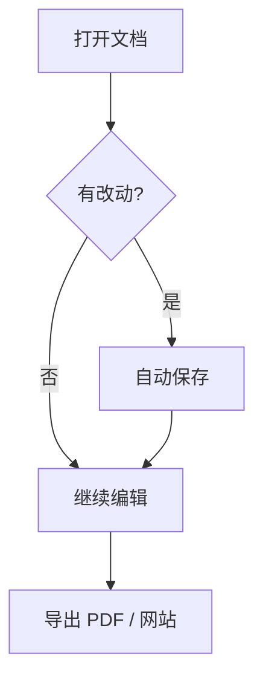
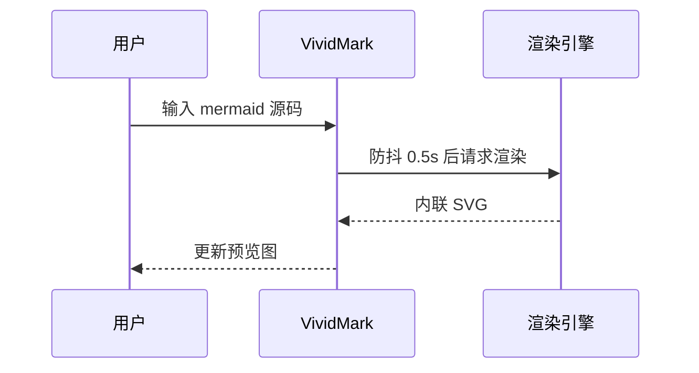
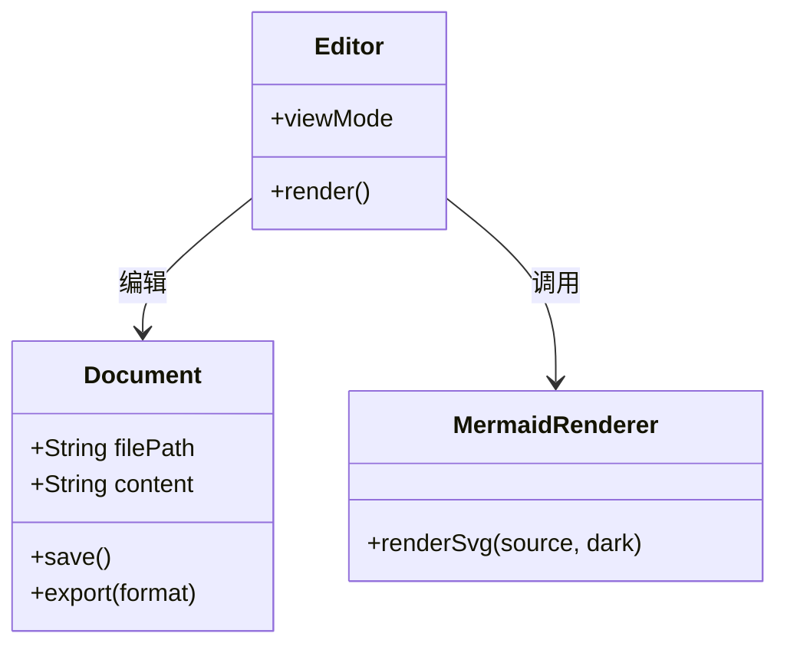
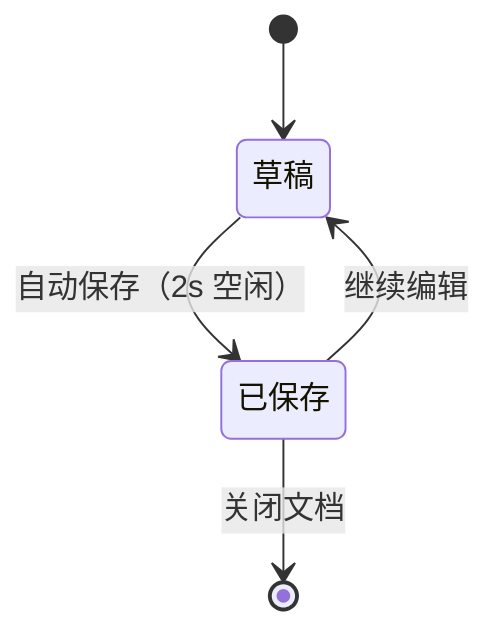
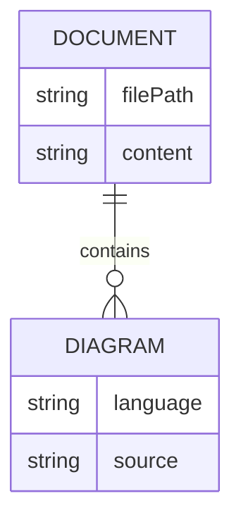
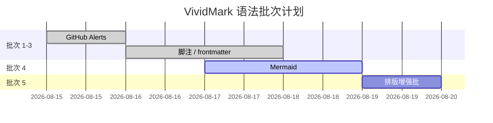
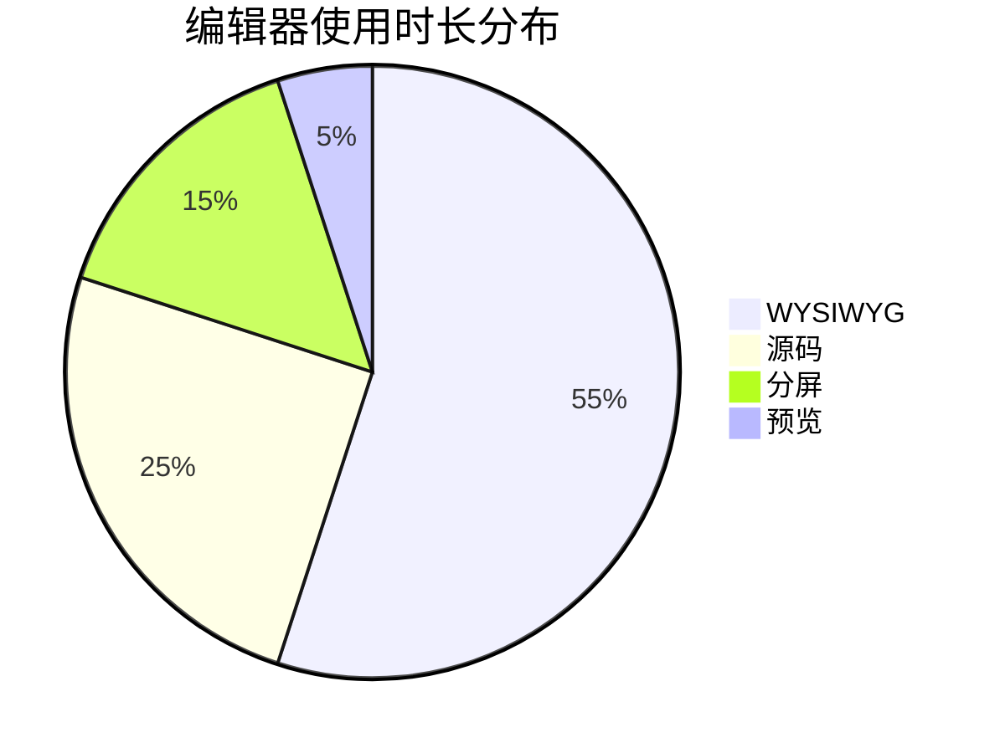
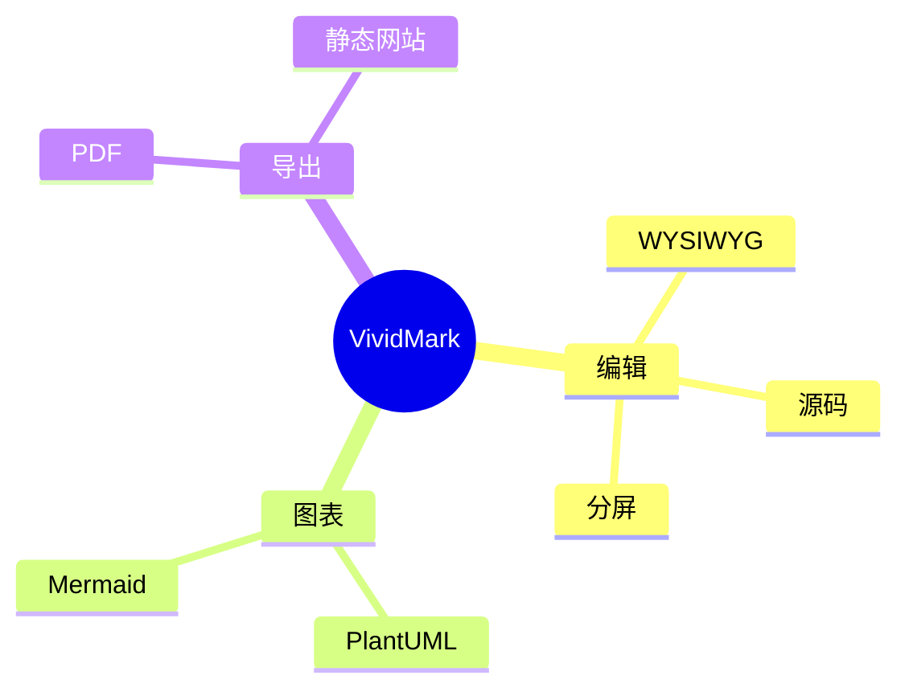
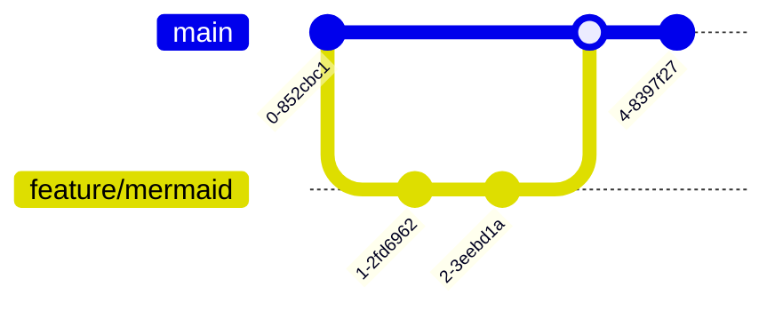

# Mermaid 图表示例（本地离线渲染）

> 本文档覆盖 VividMark 支持的 Mermaid 语法形态与常见图例，可用于测试四种视图模式的渲染效果，或作为日常写作的语法参考。所有图表由内置 mermaid.js 离线渲染（首个图表出现时按需加载），无需联网。

**快速体验**

- **WYSIWYG 模式**（默认）：` ```mermaid ` 代码块上方显示预览图、下方可直接编辑源码，停止输入约 0.5s 后自动刷新
- **源码模式** `Cmd/Ctrl + /`：查看 / 编辑 Markdown 源码；**分屏模式**左源码右预览实时联动
- **暗色模式**：图表随主题自动重新渲染为暗色配色
- **导出 PDF** `Cmd/Ctrl + P` / **导出为网站**：图表以内联 SVG 输出，导出物离线可用

## 语法速览

| 形态     | 语法                                 | 说明                                                     |
| -------- | ------------------------------------ | -------------------------------------------------------- |
| 代码块   | ` ```mermaid ` 围栏                  | 四种视图模式全部支持                                     |
| 离线渲染 | 内置 mermaid.js，无网络请求          | 语法错误时显示错误态与源码（无在线服务回退）             |
| 首次加载 | 首个图表按需加载引擎（chunk 较大）稍慢 | 之后的结果有缓存，同图重复出现即时显示                 |

> 注意：与 PlantUML 不同，Mermaid 没有行内语法，只有围栏代码块一种形态。

## 1. 流程图（flowchart）



## 2. 时序图（sequenceDiagram）



## 3. 类图（classDiagram）



## 4. 状态图（stateDiagram-v2）



## 5. ER 图（erDiagram）



## 6. 甘特图（gantt）



## 7. 饼图（pie）



## 8. 思维导图（mindmap）



## 9. Git 图（gitGraph）



## 10. 边界与降级形态

**语法错误**：渲染失败时显示错误样式与源码（不会像 PlantUML 那样回退在线服务）：

```mermaid
flowchart TD
    A[开始] --> B{这是故意写错的语法
```

**空代码块**：` ```mermaid ` 后没有内容时，预览区保持占位、不渲染。

**行内提及**：在行内代码中书写 ` ```mermaid ` 或 `graph TD` 不会触发渲染。

## 更多语法

Mermaid 还支持用户旅程图、时间线（timeline）、象限图、XY 图等，完整语法参考 [Mermaid 官方文档](https://mermaid.js.org/)。内置引擎与 npm 正式版保持同步，不依赖外部资源的语法都可离线使用。
