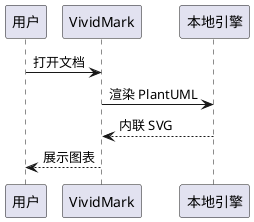
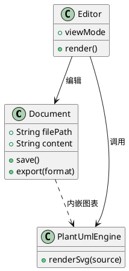
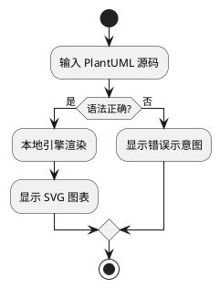
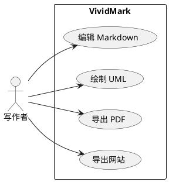
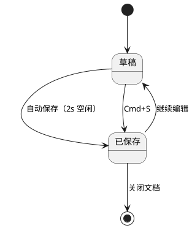
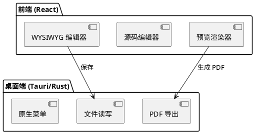

# PlantUML 图表示例（本地离线渲染）

> 本文档覆盖 VividMark 支持的 PlantUML 语法形态与常见图例，可用于测试四种视图模式的渲染效果，或作为日常写作的语法参考。所有图表由内置本地引擎（@plantuml/core）离线渲染，无需联网。

**快速体验**

- **WYSIWYG 模式**（默认）：` ```plantuml ` 代码块上方显示预览图、下方可直接编辑源码，停止输入约 0.5s 后自动刷新
- **源码模式** `Cmd/Ctrl + /`：查看 / 编辑 Markdown 源码；**分屏模式**左源码右预览实时联动
- **暗色模式**：图表随主题自动重新渲染为暗色配色
- **导出 PDF** `Cmd/Ctrl + P` / **导出为网站**：图表以内联 SVG 输出，导出物离线可用

## 语法速览

| 形态       | 语法                                     | 说明                                                         |
| ---------- | ---------------------------------------- | ------------------------------------------------------------ |
| 代码块     | ` ```plantuml ` 围栏                     | **推荐**，四种视图模式全部支持；块内书写完整 `@startuml...@enduml` |
| 行内块     | 独立段落直接书写 `@startuml...@enduml`   | 在 源码/分屏/预览 模式渲染；WYSIWYG 模式显示为源码文本       |
| 离线渲染   | 内置引擎，无网络请求                     | 渲染失败时回退 PlantUML 在线服务                             |
| 首次加载   | 首张图渲染需加载引擎（约数 MB）稍慢      | 之后的结果有缓存，同图重复出现即时显示                       |

> 注意：`@startuml` 与 `@enduml` 标记必须书写（两种形态都需要）；`!include` 远程资源与 emoji sprite 未内置，引用外部主题的写法在离线环境不可用。

## 1. 时序图



## 2. 类图



## 3. 活动图



## 4. 用例图



## 5. 状态图



## 6. 组件图



## 7. 行内语法示例

下面这段没有用围栏，直接以 `@startuml` 独立段落书写。它在**源码/分屏/预览**模式下会渲染为图表；在 WYSIWYG 模式下显示为源码文本（该模式的行内语法支持是后续项）。

@startuml
Alice -> Bob: 行内语法
Bob --> Alice: 无需围栏
@enduml

## 更多语法

PlantUML 还支持部署图、ER 图、甘特图、思维导图等，完整语法参考 [PlantUML 官方文档](https://plantuml.com/)。本地引擎与官方版本保持同步，绝大多数不依赖外部资源的语法都可离线使用。
